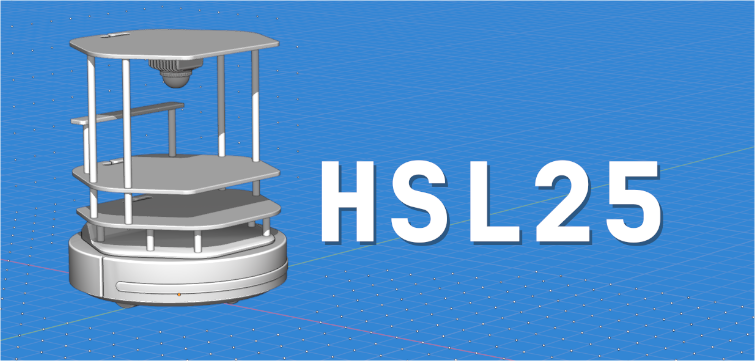
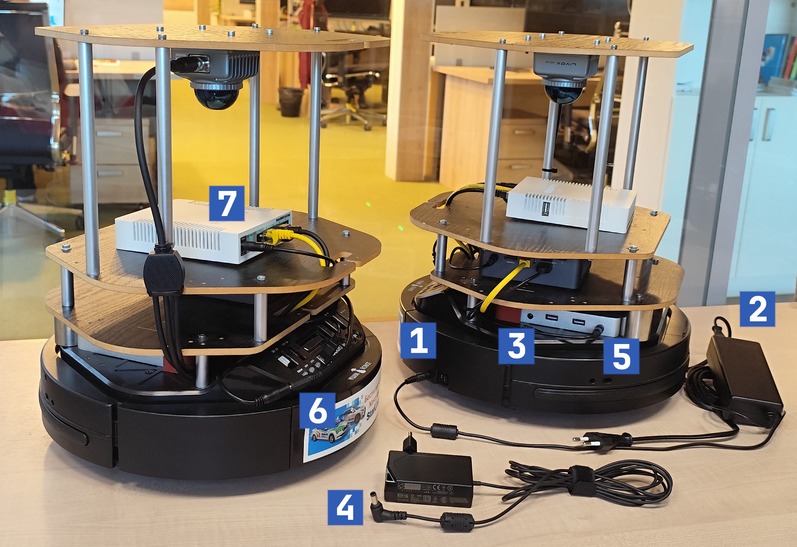

<!-- Written by Nikolay Dema <ndema2301@gmail.com>, Jun 2025 -->

### Хакатон СтарЛайн 2025 [ HSL25 ]

Репозиторий содержит ПО, необходимое для участия в Хакатоне, проводимом
НПО СтарЛайн в 2025 году.

### Работа с Turtlebot 2

Конфигурация мобильного робота turtlebot v2 включает:

* Колесную базу с дифферециальным типом привода kobuki

* Лидар Livox MID-360

* Бортовой ПК ​Intel NUC [BOXNUC7I7BNH]

* Для организации локальной подсети робота используется
  [MikroTik RB951G-2HND](https://mikrotik.ru/katalog/katalog/hardware/wifi_routers/wireless_soho/routerboard-951g-2hnd).

* Для питания бортового ПК и всей дополнительной сенсорики используется
  дополнительный аккумулятор Rombica NEO PRO 280

Цифрами 1 и 2 на изображении ниже отмечены разъем и соответствующий блок
питания для зарядки kobuki. Во время зарядки лампочка на задней панели
робота начнет мигать. По окончании зарядки лампочка перестает мигать, а
робот подаст одиночный звуковой сигнал. Для начала зарядки колесная база
должна быть включена.

Цифрами 3 и 4 отмечены разъем и соответствующий блок питания для
зарядки Rombica. Выход питания Rombica отмечен цифрой 5, оно подается на NUC,
MikroTik и через коннектор 6 на Livox MID-360.

К MikroTik, обозначенному цифрой 7, в сетевой интерфейс eth2 подключается
NUC, в eth3 Livox MID-360.

Для начала работы последовательно включите колесную базу робота,
дополнительный аккумулятор и бортовой ПК. Через некоторое время,
около 1-ой минуты, робот должен стать доступен по сети через ssh.

#### Установка требуемого ПО

1. Если вы получили робота во время участия в хакатоне, то смело переходите к
   следующему разделу, все требуемое ПО уже должно быть установлено на роботе.
   Репозиторий располагается в домашней директории пользователя __tb*__,
   где __*__ - порядковый номер вашего робота.

2. Склонируйте репозиторий и перейдите в корневую директорию репозитория.

3. Установите docker

4. Задайте udev-правила для kobuki:

        bash kobuki/scripts/udev_rules/udev_setup.bash

#### Использование docker-контейнера и организация процесса разработки

1. Для подготовки решения предлагается собрать использовать свой docker-образ
на базе организационного. Для этого доступны следующие команды:

        bash docker/build.bash  - сборка образа
        bash docker/run.bash    - запуск контейнера (режим robot)
        bash docker/run_bag.bash - запуск контейнера (режим bag)
        bash docker/into.bash   - запуск bash в контейнере
        bash docker/stop.bash   - остановка контейнера

2. Аппаратный стек находится в `kobuki/workspace` и собирается внутри docker-образа
один раз. Своё решение размещайте в `solution/workspace`, этот overlay монтируется
в контейнер как `/workspace`, поэтому разработку можно вести как внутри, так и вне контейнера.

    *Если вы получили робота во время участия в хакатоне, то оба workspace уже собраны и можно перейти к следующему разделу.*

    Для пересборки своих пакетов откройте новую bash-сессию в контейнере, подключите
    базовый стек и запустите colcon:

        bash docker/into.bash
        source /kobuki_ws/install/setup.bash
        cd /workspace
        colcon build --symlink-install --cmake-args  -DCMAKE_BUILD_TYPE=Release

    **После первой сборки окружения требуется переоткрыть bash-сессию в контейнере,
    чтобы собранные пакеты стали видимы в системе.**

#### Работа с окружением, описание предоставляемого ПО

1. Для запуска драйверов следует использовать соответствующие launch файлы:

        ros2 launch kobuki_node kobuki.launch.py       - запуск драйвера kobuki
        ros2 launch livox_ros_driver2 mid360.launch.py - запуск драйвера лидара

    Запустите драйвер kobuki, затем откройте новый терминал, войдите в контейнер и запустите teleop:

        bash docker/into.bash
        ros2 run teleop_twist_keyboard teleop_twist_keyboard /cmd_vel:=/commands/velocity

     В случае, если вы можете управлять роботом, то подготовку к работе с Turtlebot 2 можно считать оконченой.
